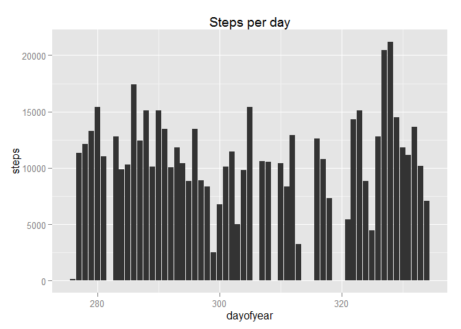
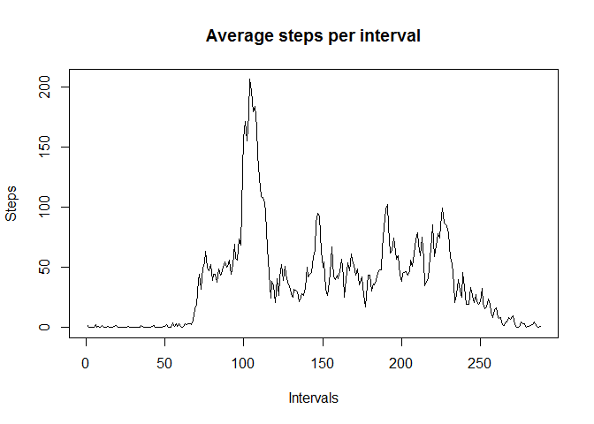
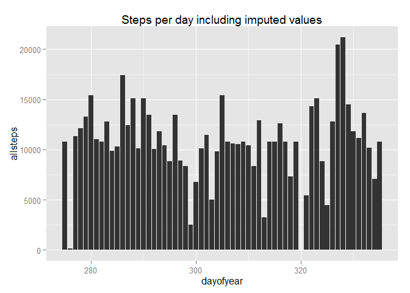
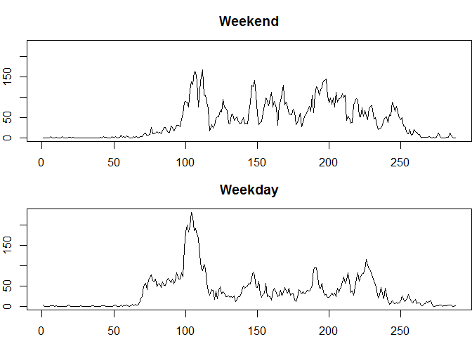

# Reproducible Research: Peer Assessment 1

Load the packages necessary for this analysis:


```r
library(dplyr)
library(lubridate)
library(ggplot2)
```


## Loading and preprocessing the data

Read the activity.csv file.  Also change the date field's data type from factor to date and create a "day-of-year" field to enable easy splitting of the data into days:


```r
df<-read.csv("activity.csv")
df<-mutate(df,date=ymd(date),dayofyear=yday(date))
```


## What is mean total number of steps taken per day?

Draw a histogram of the number of steps taken per day:


```r
qplot(dayofyear,steps,data=df,geom="histogram",stat="identity",
      main="Steps per day")
```

 

Calculate mean and median steps per day:


```r
dailysteps<-tapply(df$steps,df$dayofyear,sum,na.rm=TRUE)
meansteps<-mean(dailysteps)
mediansteps<-median(dailysteps)
meansteps
```

```
## [1] 9354.23
```

```r
mediansteps
```

```
## [1] 10395
```

These calculations give us a mean daily steps result of 9354 and a median daily steps result of 10395.


## What is the average daily activity pattern?

Produce a time-series graph across the intervals:


```r
periodactivity<-(tapply(df$steps,df$interval,mean,na.rm=TRUE))

plot(periodactivity,type="l",main="Average steps per interval",
     ylab="Steps",xlab="Intervals")
```

 

Extract the maximum interval:


```r
maxinterval<-which.max(periodactivity)
maxintervalsteps<-periodactivity[maxinterval]
maxinterval
```

```
## 835 
## 104
```

```r
maxintervalsteps
```

```
##      835 
## 206.1698
```

Therefore, the 5-minute interval, on average across all the days in the dataset which contains the maximum number of steps is interval 104, the number of steps being approximately 206.  This interval occurs in the period between 8am and 9am.


## Imputing missing values

Calculate the number of rows containing missing values:


```r
nrow(df)-sum(complete.cases(df))
```

```
## [1] 2304
```

Our strategy for imputing these missing values will be to replace them with the means for the particular 5-minute intervals in which they occur.


```r
steps<-df$steps
intval<-df$interval

## loop through the steps vector and replace with previously calculated interval
## average where NA is encountered

for (x in 1:length(steps)) {
    if (is.na(steps[x])) {
        steps[x]<-periodactivity[match(intval[x],intval)]
    }
}

## create a new dataset using this new steps data plus the original fields

dfcomplete<-df
dfcomplete[,"allsteps"]<-steps

## replace the original steps field with the new allsteps field to make the new
## dataset equal to the original but with the missing data filled in

dfcomplete<-select(dfcomplete,allsteps,date,interval,dayofyear)
```

Draw a histogram of the number of steps taken per day with the missing values imputed:


```r
qplot(dayofyear,allsteps,data=dfcomplete,geom="histogram",stat="identity",
      main="Steps per day including imputed values")
```

 

Calculate the new mean and median steps per day:


```r
newdailysteps<-tapply(dfcomplete$allsteps,dfcomplete$dayofyear,sum,na.rm=TRUE)
newmeansteps<-mean(newdailysteps)
newmediansteps<-median(newdailysteps)
newmeansteps
```

```
## [1] 10766.19
```

```r
newmediansteps
```

```
## [1] 10766.19
```

As would have been expected, the mean and median daily steps are somewhat higher with missing values imputed.  Interestingly, the mean and the median are now exactly equal, whereas the mean was quite a bit lower when we disregarded the missing values.

## Are there differences in activity patterns between weekdays and weekends?

Create a factor variable in the dataset to indicate weekday or weekend:


```r
dfcomplete<-mutate(dfcomplete,
    weeksplit=ifelse(weekdays(date)=="Saturday"|weekdays(date)=="Sunday",
                    "weekend","weekday"))
```

Draw time series plots for the average steps per 5-minute interval during weekends and weekdays - intervals on the x-axis, number of steps on the y-axis:


```r
## calculate the respective means

dfweekend<-filter(dfcomplete,weeksplit=="weekend")
weekendactivity<-tapply(dfweekend$allsteps,dfweekend$interval,mean)
dfweekday<-filter(dfcomplete,weeksplit=="weekday")
weekdayactivity<-tapply(dfweekday$allsteps,dfweekday$interval,mean)

## establish which has the greatest y-axis value so that we can draw our plots 
## to the same scale

ymax<-max(weekdayactivity)
if (max(weekendactivity) > ymax) {ymax = max(weekendactivity)}

## draw the plots

par(mfrow=c(2,1),mar=c(2,2,3,0))
plot(weekendactivity,type="l",main="Weekend",ylim=c(0,ymax))
plot(weekdayactivity,type="l",main="Weekday",ylim=c(0,ymax))
```

 


As we can see, steps are much more evenly distributed during weekends.
